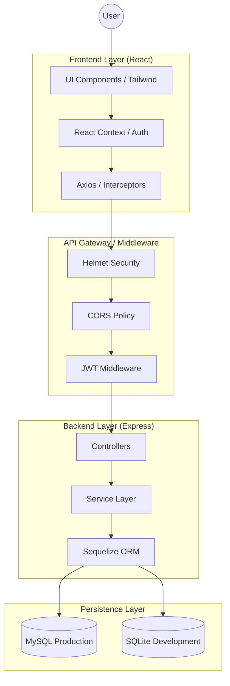

# 🏗️ Detailed System Architecture

This document provides a comprehensive deep-dive into the architectural patterns, data flow, and technical stack of **RetailSphere**.

---

## 🛰️ High-Level Component View

RetailSphere follows a **Decoupled, Monorepo, Modular, Layered (Controller-Service-Model) Client-Server Architecture**. The frontend communicates with the backend via a stateless RESTful JSON API.

---

## 🎨 Frontend Architecture

The frontend is built with **React 18** and **Vite**, focusing on component reusability and type-safety.

### 1. Networking & Interceptors
We utilize a centralized `apiClient` (`src/api/client.ts`) wrapper.
- **Request Interceptors**: Automatically injects the JWT token from `localStorage` into the `Authorization` header.
- **Response Interceptors**: Global error handling. If a `401 Unauthorized` is received (token expired), the system automatically flushes local credentials and redirects to `/login`.

### 2. State & Authentication
- **React Context API**: Used for `AuthContext`, providing `user`, `role`, and `isRole()` helper functions to every consumer in the component tree.
- **Conditional Nav**: The Sidebar (`Layout.tsx`) dynamically renders menu items based on the user's role defined in the `navItems` configuration.

---

## ⚙️ Backend Architecture

The backend follows a **Modular CSM (Controller-Service-Model)** pattern to separate concerns and improve testability.

### 1. Request Validation (Zod)
Before reaching any business logic, incoming requests are validated using **Zod schemas**. This ensures that the data is structurally sound and type-safe from the moment it enters the system.

### 2. The Service Layer
Unlike standard "Fat Controllers", RetailSphere implements a dedicated **Service Layer**. 
- **Controllers**: Solely responsible for handling HTTP specifics (request extraction, response status codes).
- **Services**: Contain all heavy business logic (e.g., calculating batch totals, checking stock levels, transaction management).

### 3. Database & ORM
- **Sequelize**: Used as the abstraction layer, allowing seamless switching between **MySQL** (for production environments) and **SQLite** (for zero-configuration local development).

---

## 🛡️ Security & Role-Based Access (RBAC)

Security is implemented at both the **UI** and **API** levels.

| Layer | Implementation |
|---|---|
| **API Protection** | Routes are wrapped in a `protect` middleware that verifies the JWT signature. |
| **Role Verification** | Specific endpoints (like User Management) use `restrictTo('Admin')` middleware. |
| **Stateless Sessions** | RetailSphere uses self-contained JWT tokens, making the server horizontally scalable as no session data is stored in memory. |

---

## 🔄 Data Lifecycle: Example Flow (Sale Transaction)

1. **Client**: User adds items to cart and clicks "Complete Sale".
2. **Networking**: Axios sends a POST to `/api/sales` with the JWT token.
3. **Backend Middleware**: `protect` verifies the token.
4. **Backend Controller**: Receives the payload and passes it to `sales.service.ts`.
5. **Service Layer**:
    - Validates product availability.
    - Initiates a SQL Transaction.
    - Deducts stock from the appropriate Batches (FIFO logic).
    - Creates the `Sale` and `SaleDetail` records.
    - Commits the transaction.
6. **Backend Controller**: Sends back the invoice ID and success message.
7. **Client UI**: Refreshes the local stock view and shows a success toast.

---

[Back to Main README](../README.md)
